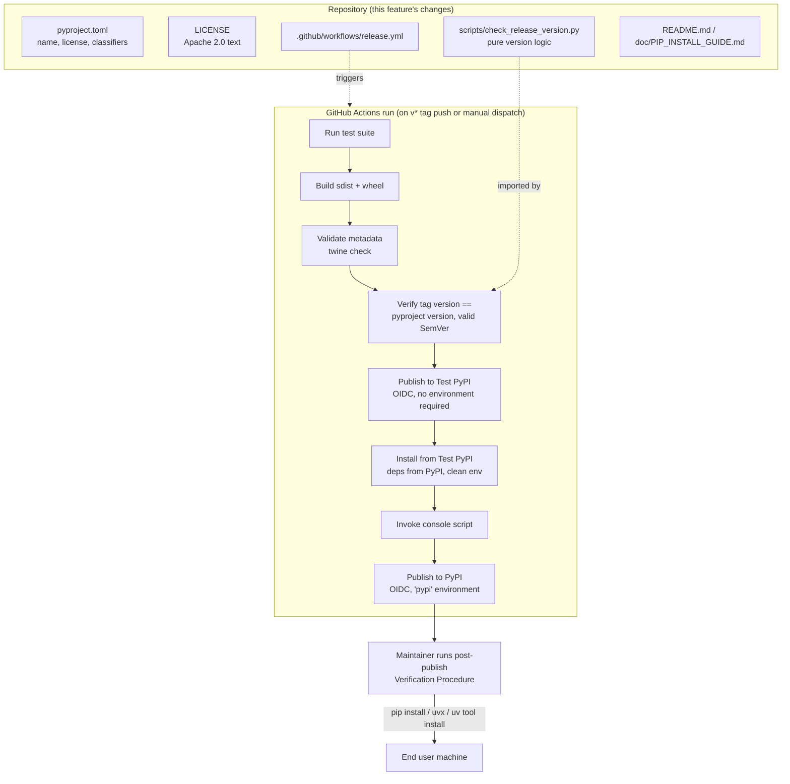
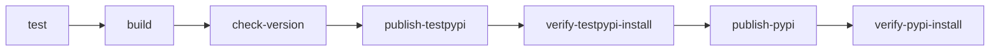

# Design Document

## Overview

This feature turns `pow-mcp-rag-new` into a publicly installable PyPI package. Today the project
only exists as a local checkout — installed via Docker, a local `pypiserver` index, or a manually
built wheel. The changes here are almost entirely **packaging metadata, CI automation, and
documentation** — no runtime behavior of the MCP server itself changes.

Three concerns are in scope:

1. **Metadata correctness** — `pyproject.toml` needs a PyPI-available distribution name
   (`pow-rag-mcp`), an OSI-approved license (Apache License 2.0, replacing `"Proprietary"`), and the classifiers
   PyPI expects, while the importable package (`rag_mcp`) and console script (`rag-mcp`) stay
   exactly as they are today.
2. **A safe, automated release pipeline** — a GitHub Actions workflow, triggered by pushing a
   `v<version>` tag, that runs tests, builds artifacts, validates them, publishes to Test PyPI
   first, verifies the Test PyPI install actually works, and only then publishes to PyPI using
   OIDC Trusted Publishing (no stored tokens). A small, pure version-checking module backs the
   workflow's version-tag/`pyproject.toml` consistency and SemVer precedence gates, and is the one
   part of this feature with genuine algorithmic logic worth property-based testing.
3. **Documentation** — README.md and `doc/PIP_INSTALL_GUIDE.md` need a public-PyPI install path
   (`uvx --from pow-rag-mcp rag-mcp ...`, `uv tool install pow-rag-mcp`, `pip install
   pow-rag-mcp`) alongside the existing local-index flow, plus a documented local dry-run
   procedure and a documented post-publish verification procedure.

### Why `pow-rag-mcp`

`rag-mcp` and `rag-mcp-server` are both already registered on PyPI by unrelated projects. The
distribution name is purely a PyPI-registry concern — the importable package (`import rag_mcp`)
and the console script (`rag-mcp`) are declared independently in `pyproject.toml` and do not have
to match `project.name`. Keeping them unchanged means no code, no existing docs referencing
`rag-mcp docs`/`rag-mcp serve`/`rag-mcp index`, and no existing `mcp.json` entries need to change
— only the string a user passes to `pip install` / `uvx --from` / `uv tool install` changes.

## Architecture



The release pipeline is a single workflow file with sequential jobs so that a failure at any
gate (tests, build, metadata validation, version check, Test PyPI install/run) stops the
pipeline before PyPI is ever touched. Test PyPI publishing has no required manual-approval
environment (Requirement 6.4); PyPI publishing runs under a dedicated `pypi` GitHub Environment,
which the Maintainer configures with the Trusted Publisher binding (Requirement 6.3).

## Components and Interfaces

### 1. `pyproject.toml` (modified)

Changes only, no new build system:

| Field | Current | New |
|---|---|---|
| `project.name` | `"rag-mcp"` | `"pow-rag-mcp"` |
| `project.license` | `{ text = "Proprietary" }` | `"Apache-2.0"` (SPDX string form) |
| `project.classifiers` | *(absent)* | Development status, license, and one `Programming Language :: Python :: 3.<minor>` entry per minor version covered by `requires-python` (currently `>=3.11`, so `3.11`, `3.12`, `3.13`, ... kept in sync manually as `requires-python` changes) |
| `project.readme` | `"README.md"` | unchanged value, but combined with `license` migrating off the legacy `license.text`/classifier-license duality that setuptools warns about |
| `project.scripts` | `rag-mcp = "rag_mcp.cli:main"` | **unchanged** |
| `[tool.setuptools.packages.find]` | `where = ["src"]` | **unchanged** — `rag_mcp` import package is untouched |

No other table changes. `project.version` remains the single source of truth for the version
(Requirement 4.2); the release workflow reads it via `python -m build`'s own metadata output
rather than duplicating a parser.

### 2. `LICENSE` (new file, repo root)

Full Apache License 2.0 text with the copyright holder and year filled in (no `[yyyy]`/
`[name of copyright owner]` placeholders left, per Requirement 2.1). Referenced from
`project.license` (`"Apache-2.0"`) and from a `"License :: OSI Approved :: Apache Software
License"` classifier, and linked from the README.

### 3. `scripts/check_release_version.py` (new file)

The one piece of this feature with real branching logic, so it's factored out of the workflow
YAML into a small, independently testable Python module (importable by tests, runnable as a CLI
step in the workflow). It has no dependencies beyond the standard library.

```python
def parse_tag_version(tag: str) -> str:
    """Strip a leading 'v' from a Version_Tag. Raises ValueError if the tag
    does not start with 'v'."""

def is_valid_semver(version: str) -> bool:
    """Return True iff `version` matches the SemVer 2.0.0 grammar
    (MAJOR.MINOR.PATCH, optional -prerelease, optional +build)."""

def compare_semver(a: str, b: str) -> int:
    """Return -1, 0, or 1 comparing `a` and `b` per SemVer 2.0.0 precedence
    rules (numeric MAJOR.MINOR.PATCH comparison, then dot-separated
    pre-release identifier comparison, build metadata ignored). Raises
    ValueError if either input is not valid SemVer."""

def check_release(tag: str, pyproject_version: str, latest_published_version: str | None) -> None:
    """Run all four release-gating checks (Requirements 4.3-4.6) in order,
    raising ReleaseVersionError with a specific message on the first
    failure:
      1. tag matches 'v<version>' and parse_tag_version succeeds
      2. parse_tag_version(tag) is valid SemVer
      3. pyproject_version is valid SemVer
      4. parse_tag_version(tag) == pyproject_version (exact string match)
      5. if latest_published_version is not None: parse_tag_version(tag) has
         strictly greater SemVer precedence than latest_published_version
    """
```

`check_release` is invoked as a workflow step (`python scripts/check_release_version.py
"$GITHUB_REF_NAME" "$(python -c "...read project.version...")" "$LATEST_PUBLISHED"`) after the
build and metadata-validation steps but before the Test PyPI publish step, and exits non-zero
with the specific failing reason on stderr so the Actions run surfaces the exact cause
(Requirements 4.4, 4.5, 4.6, 5.3).

The `latest_published_version` argument is resolved by a preceding step that queries PyPI's JSON
API (`https://pypi.org/pypi/pow-rag-mcp/json`) for the current release; a 404 (first-ever
release) is treated as "no prior version" and skips check 5.

### 4. `.github/workflows/release.yml` (new file)

Jobs, in dependency order (`needs:`), matching the packaging.python.org / `pypa/gh-action-pypi-publish`
recommended structure (see Research below):



- **Trigger**: `on: push: tags: ['v*']` and `on: workflow_dispatch:` (Requirements 5.1, 5.7).
- **`test`**: checks out the repo, sets up Python, installs `.[dev]`, runs `pytest`
  (Requirement 5.2).
- **`build`**: runs `python -m build` (sdist + wheel), uploads `dist/` as a workflow artifact
  (Requirement 5.4). Runs regardless of validation outcome of later steps — it only depends on
  `test` — so the build step itself is not gated by the validator, per Requirement 1.5.
- **`check-version`** (this job *is* the "Build_Validator" gate plus the version gate): downloads
  the `dist/` artifact, runs `twine check dist/*` (metadata + long-description-rendering
  validation, Requirement 1.4) as a step separate from and after `build`, then runs
  `scripts/check_release_version.py` (Requirements 4.3-4.6). Any failure here stops the pipeline
  before any upload step is reachable (Requirements 1.6, 5.3).
- **`publish-testpypi`**: `needs: check-version`; environment `testpypi` (no required
  reviewers, Requirement 6.4); `permissions: id-token: write`; uses
  `pypa/gh-action-pypi-publish@release/v1` with `repository-url:
  https://test.pypi.org/legacy/` (Requirements 6.1, 6.2, 7.1).
- **`verify-testpypi-install`**: `needs: publish-testpypi`; spins up a fresh job (fresh runner ⇒
  no pre-existing install, Requirement 7.2); `pip install --index-url
  https://test.pypi.org/simple/ --extra-index-url https://pypi.org/simple/ pow-rag-mcp` so
  dependencies resolve from PyPI while the package itself comes from Test PyPI
  (Requirement 7.3); then runs `rag-mcp --help` (or another cheap, deterministic subcommand) and
  fails the job on any non-zero exit or stderr output (Requirement 7.4); a failure here stops
  the workflow before `publish-pypi` runs (Requirements 7.5, 7.6).
- **`publish-pypi`**: `needs: verify-testpypi-install`; environment `pypi` (Maintainer-configured
  required-reviewer environment, Requirement 6.3); `permissions: id-token: write`; uses
  `pypa/gh-action-pypi-publish@release/v1` with default `repository-url` (pypi.org)
  (Requirements 5.5, 6.1, 6.2).
- **`verify-pypi-install`**: `needs: publish-pypi`; fresh runner; `pip install pow-rag-mcp` into
  a clean venv and invokes the console script, matching the commands documented in the
  Verification Procedure (Requirement 8, surfaced in workflow logs for the Maintainer to
  double-check; the authoritative manual repeat of this is documented per Requirement 8.6).

Any job in this chain failing marks the whole run failed and (by construction of the `needs:`
chain) prevents any later job — including both publish jobs — from starting
(Requirements 5.3, 5.6).

### 5. Local dry-run procedure (documentation, no new tooling)

Documented in `doc/PIP_INSTALL_GUIDE.md` as a "Local release dry run" subsection using the
project's existing `build` + `twine` tooling (no upload command included, per Requirement 10.1):

```bash
python -m pip install build twine
python -m build
python -m twine check dist/*
```

`twine check` is the same validator class referenced as "Build_Validator" throughout — used both
locally (Requirement 10) and in CI (`check-version` job, Requirement 1). Running it locally lets
a Maintainer catch metadata problems (bad README rendering, missing classifiers, invalid
version) without pushing a tag.

### 6. Documentation updates

- **`README.md`**: Quick Start gains a "PyPI (recommended for new users)" subsection documenting
  `uvx --from pow-rag-mcp rag-mcp serve`, `uv tool install pow-rag-mcp`, and `pip install
  pow-rag-mcp`, each explicitly noting no repo checkout / no local index is needed
  (Requirements 9.1, 9.2), naming the distribution as `pow-rag-mcp` versus the unrelated
  `rag-mcp`/`rag-mcp-server` packages (Requirement 3.8), stating the minimum Python version
  matching `requires-python` (Requirement 9.5), and linking to the Apache 2.0 `LICENSE` file
  (Requirement 2.4).
- **`doc/PIP_INSTALL_GUIDE.md`**: restructured into two clearly headed top-level sections —
  **"Public PyPI install"** (new; `pip install pow-rag-mcp`, `uvx --from pow-rag-mcp`, `uv tool
  install pow-rag-mcp`, recommended for new users with no checkout) and **"Local index install"**
  (the existing `pypiserver` + local wheel content, retitled and recommended for
  maintainers/contributors testing unpublished changes) — plus a new **"Local release dry
  run"** section (component 5 above) and a new **"Post-publish verification"** section
  documenting the exact commands/expected exit codes from Requirement 8 for manual repetition.

## Data Models

This feature has no runtime data models, databases, or API payloads — it is packaging
configuration, CI workflow definitions, and documentation. The only structured "data" is the
version string itself, which follows the SemVer 2.0.0 grammar:

```
<version> ::= <major> "." <minor> "." <patch> ["-" <pre-release>] ["+" <build>]
<major>, <minor>, <patch> ::= non-negative integer, no leading zero (except "0" itself)
<pre-release> ::= dot-separated alphanumeric/hyphen identifiers (numeric identifiers must not have leading zeros)
<build> ::= dot-separated alphanumeric/hyphen identifiers (ignored for precedence)
```

`scripts/check_release_version.py` operates purely on strings satisfying (or failing to satisfy)
this grammar — this is the input space explored by the correctness properties below.

## Correctness Properties

*A property is a characteristic or behavior that should hold true across all valid executions of
a system-essentially, a formal statement about what the system should do. Properties serve as the
bridge between human-readable specifications and machine-verifiable correctness guarantees.*

Almost everything in this feature is static metadata, CI workflow wiring, or documentation
content — none of which varies meaningfully across inputs, so property-based testing does not
apply to it (see prework analysis; those criteria are covered by example-based/config checks and
CI integration checks instead). The one exception is the version-tag/SemVer logic in
`scripts/check_release_version.py`, which is a pure function operating over an effectively
unbounded string input space and gates whether the release pipeline is allowed to publish. That
logic is the sole target of property-based testing for this feature.

**Property reflection**: The initial candidate properties were (a) tag-stripping round-trip,
(b) SemVer validity classification used at both the tag-derived-version site and the
`pyproject.toml`-version site, (c) exact-match gating between the two, and (d) SemVer precedence
ordering used for the "greater than latest published" gate. (b) is a single shared validator
used in two acceptance criteria (4.3 and 4.5) — one property covers both call sites, since the
underlying function is identical. (a), (c), and (d) each test a genuinely distinct operation
(string transformation, equality gating, ordering) with no logical overlap, so all four are kept.

### Property 1: Tag version stripping round-trip

*For any* valid SemVer string `V`, constructing a tag as `"v" + V` and passing it through
`parse_tag_version` SHALL return exactly `V`.

**Validates: Requirements 4.3**

### Property 2: SemVer validity classification is exact

*For any* string `S`, `is_valid_semver(S)` SHALL return `True` if and only if `S` conforms to the
SemVer 2.0.0 grammar (numeric `MAJOR.MINOR.PATCH` with no leading zeros, optional dot-separated
pre-release identifiers, optional dot-separated build metadata) — this SHALL hold both for
strings generated to be valid SemVer and for strings generated to violate the grammar (e.g.
leading zeros, missing components, non-numeric major/minor/patch, empty identifiers).

**Validates: Requirements 4.1, 4.3, 4.5**

### Property 3: Version match gate is exact-equality

*For any* two version strings `A` and `B`, `check_release`'s tag/pyproject match check SHALL
raise `ReleaseVersionError` if and only if `A != B` as strings (no normalization, no numeric
tolerance) — for any `A`, checking `A` against itself SHALL always pass.

**Validates: Requirements 4.4**

### Property 4: SemVer precedence ordering and publish gate

*For any* two valid SemVer strings `A` and `B`, `compare_semver(A, B)` SHALL follow SemVer 2.0.0
precedence rules — numeric comparison of `MAJOR`, then `MINOR`, then `PATCH`; a version without a
pre-release has higher precedence than the same `MAJOR.MINOR.PATCH` with a pre-release;
pre-release identifiers compare per-dot-segment (numeric segments compared numerically,
alphanumeric segments compared lexically, numeric segments always lower precedence than
alphanumeric); build metadata is ignored entirely — and SHALL be consistent (antisymmetric and
transitive: `compare_semver(A,B) == -compare_semver(B,A)`; if `compare_semver(A,B) <= 0` and
`compare_semver(B,C) <= 0` then `compare_semver(A,C) <= 0`). Consequently, `check_release`'s
"greater than latest published" gate SHALL reject exactly when `compare_semver(tag_version,
latest_published_version) <= 0`.

**Validates: Requirements 4.6**

## Error Handling

| Failure point | Detection | Behavior |
|---|---|---|
| Test suite fails | `test` job exit status | Workflow run fails; `build` still runs if independently triggered by the same `needs` graph — no, `build` `needs: test`, so it does not run; no artifacts produced (Req 5.2, 5.3) |
| Build produces invalid sdist/wheel | `twine check` in `check-version` job | Job fails with twine's specific error message in logs; no publish job reachable (Req 1.4, 1.6) |
| Tag not `v<semver>` / doesn't match `pyproject.toml` version / not greater than latest published | `check_release()` raises `ReleaseVersionError` with a specific reason string | `check-version` job fails, printing the specific reason; no publish job reachable (Req 4.4, 4.5, 4.6, 5.3) |
| Test PyPI upload fails (network, permissions, duplicate version) | `pypa/gh-action-pypi-publish` step exit status | `publish-testpypi` job fails; `verify-testpypi-install` and everything downstream does not run (Req 5.6) |
| OIDC authentication rejected by Test PyPI/PyPI | `pypa/gh-action-pypi-publish` step exit status/output | Publish job fails with the action's authentication-error output; no artifacts published (Req 6.5) |
| Test PyPI install fails or errors | `verify-testpypi-install` job (pip exit code, captured stderr) | Job fails; `publish-pypi` (`needs: verify-testpypi-install`) does not run (Req 7.5) |
| Console script invocation (post Test PyPI install) fails or errors | Same job, script exit code/stderr | Job fails; PyPI publish blocked (Req 7.6) |
| PyPI upload fails after all prior gates passed | `publish-pypi` step exit status | Job fails, run marked failed in Actions history (Req 5.6, 5.7) |
| Post-PyPI-publish verification (pip/uvx/uv tool install) fails | `verify-pypi-install` job, and/or Maintainer manually repeating the Verification Procedure | Workflow surfaces the failure in logs; **package is already public at this point**, so the Maintainer treats the release as failed and remediates (e.g. yank the release, publish a patched version) rather than expecting an automatic rollback (Req 8.5) |
| GitHub Actions itself fails to start the workflow (outage, permissions, workflow YAML error) | No run appears / run shows configuration error in Actions history | Maintainer resolves the underlying issue and either re-pushes the Version_Tag or triggers `workflow_dispatch` manually (Req 5.7, 5.8) |
| Local dry run (`python -m build` / `twine check`) reports a metadata error | Twine/build exit code and stderr, run interactively by the Maintainer | Maintainer sees the specific error before any upload command is even available to run, since none is included in the dry-run procedure (Req 10.1, 10.2, 10.3) |

## Testing Strategy

**Unit / example-based tests** (all other acceptance criteria — see prework analysis: static
metadata, documentation content, and CI/platform behavior are not meaningfully varied by input,
so example-based checks are the right tool):

- `tests/test_packaging.py` (extend existing file): assert `project.name == "pow-rag-mcp"`,
  `project.license == "Apache-2.0"`, the Apache Software License classifier is present, one
  Python-version classifier exists per minor version implied by `requires-python`,
  `project.scripts["rag-mcp"] == "rag_mcp.cli:main"`, and the `rag_mcp` import package is still
  discoverable — i.e. update the existing `test_pyproject_toml_is_valid` assertions rather than
  adding a parallel test file.
- A new `tests/test_license_file.py`: `LICENSE` exists, contains "Apache License" and "Version
  2.0", contains no `[yyyy]`/`[name of copyright owner]` placeholder text, and `README.md` links
  to it.
- A new `tests/test_docs_content.py` (lightweight content assertions, not rendering): README.md
  contains `pow-rag-mcp`, `uvx --from pow-rag-mcp`, `uv tool install pow-rag-mcp`, `pip install
  pow-rag-mcp`, and the `requires-python` minimum version string; `doc/PIP_INSTALL_GUIDE.md`
  contains distinct headings for the public-PyPI flow and the local-index flow.
- CI/integration-level checks (run in the `release.yml` workflow itself, not as pytest unit
  tests, since they require network access to real package indexes and a real GitHub Actions
  environment): the `check-version`, `verify-testpypi-install`, and `verify-pypi-install` jobs
  described in Components and Interfaces *are* the integration tests for Requirements 1.4-1.6,
  5.1-5.8, 6.1-6.5, 7.1-7.6, and 8.1-8.4. These are exercised for real on every tagged release and
  can be exercised on demand via `workflow_dispatch` (Requirement 5.7) — running them 100 times
  with random inputs would not find more bugs than running the real pipeline once per release,
  per the PBT-vs-integration decision guide.

**Property-based tests** (`tests/test_check_release_version.py`, using `hypothesis`, already a
declared `dev` dependency — minimum 100 examples per property via Hypothesis's default
`max_examples=100` or an explicit `@settings(max_examples=100)`):

- Each property below is implemented as a **single** Hypothesis test, tagged with a comment
  referencing the design property, per the required tag format
  `Feature: pypi-package-publishing, Property N: <property text>`.
- Generators: a `valid_semver()` Hypothesis strategy builds grammar-conformant strings from
  separately generated non-negative integers (major/minor/patch, rendered without leading
  zeros) and optional pre-release/build-metadata identifier lists; an `arbitrary_version_like()`
  strategy mixes valid output with mutations (inserted leading zeros, missing components,
  non-numeric segments, empty identifiers) to exercise the negative side of Property 2.

```python
# tests/test_check_release_version.py
from hypothesis import given, strategies as st, settings
from scripts.check_release_version import (
    parse_tag_version, is_valid_semver, compare_semver, check_release, ReleaseVersionError,
)

# Feature: pypi-package-publishing, Property 1: Tag version stripping round-trip
@settings(max_examples=100)
@given(valid_semver())
def test_tag_stripping_round_trip(v):
    assert parse_tag_version("v" + v) == v

# Feature: pypi-package-publishing, Property 2: SemVer validity classification is exact
@settings(max_examples=100)
@given(arbitrary_version_like())
def test_semver_validity_is_exact(s):
    assert is_valid_semver(s) == matches_semver_grammar_reference(s)

# Feature: pypi-package-publishing, Property 3: Version match gate is exact-equality
@settings(max_examples=100)
@given(valid_semver(), valid_semver())
def test_version_match_gate(a, b):
    gate_raises = version_match_gate_raises(a, b)  # thin wrapper around check_release's match step
    assert gate_raises == (a != b)

# Feature: pypi-package-publishing, Property 4: SemVer precedence ordering and publish gate
@settings(max_examples=100)
@given(valid_semver(), valid_semver(), valid_semver())
def test_semver_precedence_consistency(a, b, c):
    assert compare_semver(a, b) == -compare_semver(b, a)
    if compare_semver(a, b) <= 0 and compare_semver(b, c) <= 0:
        assert compare_semver(a, c) <= 0
```

Unit tests complement the properties with concrete edge cases: `"1.0.0"` vs `"1.0.0-alpha"` vs
`"1.0.0-alpha.1"` vs `"1.0.0+build.1"` precedence per the SemVer 2.0.0 spec's own worked example
(`1.0.0-alpha < 1.0.0-alpha.1 < 1.0.0-alpha.beta < 1.0.0-beta < 1.0.0-beta.2 < 1.0.0-beta.11 <
1.0.0-rc.1 < 1.0.0`), a tag with no leading `v` (`parse_tag_version` raises), and a first-ever
release (`latest_published_version=None` skips the precedence gate).

## Research Notes

- **Trusted Publishing setup and job structure** follow the official PyPA guide, "Publishing
  package distribution releases using GitHub Actions CI/CD workflows"
  ([packaging.python.org](https://packaging.python.org/en/latest/guides/publishing-package-distribution-releases-using-github-actions-ci-cd-workflows/)):
  separate `pypi` and `testpypi` GitHub Environments, `permissions: id-token: write` on the
  publish jobs, `pypa/gh-action-pypi-publish@release/v1` for the actual upload, and the
  recommendation that the `pypi` environment require manual approval while `testpypi` does not.
  Content was rephrased for compliance with licensing restrictions.
- Test PyPI dependency resolution: Test PyPI does not mirror PyPI's full package set, so
  installing from it requires `--extra-index-url https://pypi.org/simple/` alongside `--index-url
  https://test.pypi.org/simple/` so the package itself resolves from Test PyPI while its
  dependencies resolve from PyPI — documented in PyPI's own "Using TestPyPI" guide and reflected
  in Requirement 7.3 and the `verify-testpypi-install` job design above.
