# Implementation Plan: PyPI Package Publishing

## Overview

This plan turns `pow-mcp-rag-new` into a publicly installable PyPI package (`pow-rag-mcp`) without
changing the importable package (`rag_mcp`) or console script (`rag-mcp`). Work proceeds in four
tracks: (1) packaging metadata + LICENSE, (2) the pure SemVer/version-gating module and its
property tests, (3) the GitHub Actions release workflow, and (4) documentation updates. Each task
carries a `Model:` annotation recommending which LLM capability tier to use, balancing
correctness against cost.

## Tasks

- [x] 1. Update package metadata for public PyPI release
  - [x] 1.1 Update `pyproject.toml` metadata
    - Change `project.name` to `"pow-rag-mcp"`
    - Change `project.license` from `{ text = "Proprietary" }` to the SPDX string
      `"Apache-2.0"`
    - Add Trove classifiers: one Development Status classifier, one
      `"License :: OSI Approved :: Apache Software License"` classifier, and one
      `"Programming Language :: Python :: 3.<minor>"` classifier per minor version permitted by
      `requires-python` (currently `>=3.11` → 3.11, 3.12, 3.13)
    - Leave `project.scripts`, `[tool.setuptools.packages.find]`, and all other tables unchanged
    - _Requirements: 1.1, 1.2, 1.3, 2.2, 2.3, 3.1, 3.2, 3.3_
    - Model: Qwen3 Coder Next (static metadata field edits, no branching logic; 0.05x credit)

  - [x] 1.2 Update `tests/test_packaging.py` assertions for new metadata
    - Update `test_pyproject_toml_is_valid` to assert `project.name == "pow-rag-mcp"`,
      `project.license == "Apache-2.0"`, the Apache Software License classifier is present,
      and one Python-version classifier exists per minor version implied by
      `requires-python`
    - Assert `project.scripts["rag-mcp"] == "rag_mcp.cli:main"` is unchanged and the `rag_mcp`
      import package is still discoverable
    - _Requirements: 1.1, 1.3, 2.2, 2.3, 3.1, 3.2, 3.3_
    - Model: Qwen3 Coder Next (mirrors metadata changes with straightforward assertions; 0.05x credit)

  - [x] 1.3 Create `LICENSE` file with Apache License 2.0 text
    - Add the full Apache License 2.0 text at the repository root with the copyright year and
      holder filled in, no `[yyyy]`/`[name of copyright owner]` placeholders remaining
    - _Requirements: 2.1_
    - Model: Qwen3 Coder Next (boilerplate file creation; 0.05x credit)

  - [x] 1.4 Write `tests/test_license_file.py`
    - Assert `LICENSE` exists, contains "Apache License" and "Version 2.0", contains no
      `[yyyy]`/`[name of copyright owner]` placeholder text, and `README.md` links to it
    - _Requirements: 2.1, 2.4_
    - Model: Qwen3 Coder Next (simple file-content assertions; 0.05x credit)

- [x] 2. Checkpoint - Ensure all tests pass
  - Ensure all tests pass, ask the user if questions arise.

- [x] 3. Implement the SemVer version-checking module
  - [x] 3.1 Implement `parse_tag_version` and `is_valid_semver` in `scripts/check_release_version.py`
    - `parse_tag_version(tag)` strips a leading `v` from a Version_Tag, raising `ValueError` if
      the tag does not start with `v`
    - `is_valid_semver(version)` returns `True` iff `version` conforms to the SemVer 2.0.0
      grammar (numeric `MAJOR.MINOR.PATCH` with no leading zeros, optional dot-separated
      pre-release identifiers, optional dot-separated build metadata)
    - _Requirements: 4.1, 4.3_
    - Model: Claude Opus 5 (SemVer grammar parsing has subtle edge cases — leading zeros, empty
      identifiers — that need careful correctness; 2.2x credit)

  - [x] 3.2 Write property test for tag version stripping round-trip
    - **Property 1: Tag version stripping round-trip**
    - **Validates: Requirements 4.3**
    - Model: Claude Opus 5 (property-based test design over an unbounded string input space;
      2.2x credit)

  - [x] 3.3 Write property test for SemVer validity classification
    - **Property 2: SemVer validity classification is exact**
    - **Validates: Requirements 4.1, 4.3, 4.5**
    - Model: Claude Opus 5 (must construct both valid and grammar-violating generators and a
      reference-grammar oracle; 2.2x credit)

  - [x] 3.4 Implement `compare_semver` in `scripts/check_release_version.py`
    - Returns -1, 0, or 1 per SemVer 2.0.0 precedence rules: numeric MAJOR.MINOR.PATCH
      comparison, then dot-separated pre-release identifier comparison (numeric segments
      compared numerically, alphanumeric compared lexically, numeric always lower precedence),
      build metadata ignored; raises `ValueError` if either input is not valid SemVer
    - _Requirements: 4.6_
    - Model: Claude Opus 5 (precedence/ordering logic with several subtle correctness rules;
      2.2x credit)

  - [x] 3.5 Write property test for SemVer precedence ordering
    - **Property 4: SemVer precedence ordering and publish gate**
    - **Validates: Requirements 4.6**
    - Model: Claude Opus 5 (must verify antisymmetry and transitivity across generated triples;
      2.2x credit)

  - [x] 3.6 Implement `check_release` and `ReleaseVersionError` in `scripts/check_release_version.py`
    - Runs the four release-gating checks in order (tag format, tag SemVer validity,
      pyproject SemVer validity, exact tag/pyproject match, and — when a prior published
      version is given — strictly-greater precedence), raising `ReleaseVersionError` with a
      specific message on the first failure
    - _Requirements: 4.4, 4.5, 4.6_
    - Model: Claude Opus 5 (ordered gate composition where getting the check order or error
      messages wrong silently changes release-safety behavior; 2.2x credit)

  - [x] 3.7 Write property test for version match gate
    - **Property 3: Version match gate is exact-equality**
    - **Validates: Requirements 4.4**
    - Model: Claude Opus 5 (must isolate the exact-match step from the rest of `check_release`;
      2.2x credit)

  - [x] 3.8 Write unit tests for version-module edge cases
    - Cover the SemVer spec's own worked precedence example
      (`1.0.0-alpha < 1.0.0-alpha.1 < 1.0.0-alpha.beta < 1.0.0-beta < 1.0.0-beta.2 <
      1.0.0-beta.11 < 1.0.0-rc.1 < 1.0.0`), a tag with no leading `v`, and a first-ever release
      (`latest_published_version=None` skips the precedence gate)
    - _Requirements: 4.3, 4.4, 4.5, 4.6_
    - Model: Claude Sonnet 5 (concrete example tests transcribed from a documented spec, less
      generative design than the property tests; 1.3x credit)

- [x] 4. Checkpoint - Ensure all tests pass
  - Ensure all tests pass, ask the user if questions arise.


- [x] 5. Add latest-published-version lookup and CLI wiring
  - [x] 5.1 Implement PyPI JSON API lookup and CLI entry point in `scripts/check_release_version.py`
    - Add a CLI main that accepts tag, pyproject version, and resolves `latest_published_version`
      by querying `https://pypi.org/pypi/pow-rag-mcp/json`; a 404 (first-ever release) is treated
      as "no prior version" and skips the precedence gate; calls `check_release` and exits
      non-zero with the specific failing reason on stderr on failure
    - _Requirements: 4.6, 5.3_
    - Model: Claude Sonnet 5 (network call plus error-code handling and argument wiring, moderate
      logic without deep algorithmic subtlety; 1.3x credit)

  - [x] 5.2 Write unit tests for the CLI wrapper
    - Cover successful invocation, a 404 response treated as "no prior version", and a
      non-2xx/non-404 PyPI API error surfaced as a CLI failure
    - _Requirements: 4.6, 5.3_
    - Model: Claude Sonnet 5 (mocking HTTP responses and exit-code/stderr assertions; 1.3x
      credit)

- [x] 6. Create the GitHub Actions release workflow
  - [x] 6.1 Create `.github/workflows/release.yml` with `test` and `build` jobs
    - Trigger on `push: tags: ['v*']` and `workflow_dispatch`; `test` job checks out the repo,
      sets up Python, installs `.[dev]`, runs `pytest`; `build` job (`needs: test`) runs
      `python -m build` and uploads `dist/` as a workflow artifact
    - _Requirements: 5.1, 5.2, 5.4, 5.7, 1.5_
    - Model: Claude Sonnet 5 (CI/YAML wiring with job-dependency and trigger-condition reasoning;
      1.3x credit)

  - [x] 6.2 Add `check-version` job to `.github/workflows/release.yml`
    - `needs: build`; downloads the `dist/` artifact, runs `twine check dist/*` as a step
      separate from and after `build`, then runs `scripts/check_release_version.py` with the
      tag, `pyproject.toml` version, and PyPI lookup result; any failure stops the pipeline
      before any upload step is reachable
    - _Requirements: 1.2, 1.4, 1.6, 2.5, 4.2, 4.3, 4.4, 4.5, 4.6, 5.3_
    - Model: Claude Sonnet 5 (wiring a gating job whose failure-mode must correctly block all
      downstream publish jobs; 1.3x credit)

  - [x] 6.3 Add `publish-testpypi` job to `.github/workflows/release.yml`
    - `needs: check-version`; environment `testpypi` (no required reviewers);
      `permissions: id-token: write`; uses `pypa/gh-action-pypi-publish@release/v1` with
      `repository-url: https://test.pypi.org/legacy/`
    - _Requirements: 5.6, 6.1, 6.2, 6.4, 6.5, 7.1_
    - Model: Claude Sonnet 5 (OIDC/trusted-publishing configuration with security-relevant
      permissions; 1.3x credit)

  - [x] 6.4 Add `verify-testpypi-install` job to `.github/workflows/release.yml`
    - `needs: publish-testpypi`; fresh runner (no pre-existing install); installs with
      `pip install --index-url https://test.pypi.org/simple/ --extra-index-url
      https://pypi.org/simple/ pow-rag-mcp`; runs `rag-mcp --help`; fails the job on any
      non-zero exit or stderr output, which stops the workflow before `publish-pypi` runs
    - _Requirements: 7.2, 7.3, 7.4, 7.5, 7.6_
    - Model: Claude Sonnet 5 (multi-step verification job with several distinct failure modes to
      wire correctly; 1.3x credit)

  - [x] 6.5 Add `publish-pypi` job to `.github/workflows/release.yml`
    - `needs: verify-testpypi-install`; environment `pypi`; `permissions: id-token: write`; uses
      `pypa/gh-action-pypi-publish@release/v1` with default `repository-url` (pypi.org)
    - _Requirements: 5.5, 5.6, 6.1, 6.2, 6.3, 6.5_
    - Model: Claude Sonnet 5 (security-sensitive OIDC publish step gated behind the full `needs`
      chain; 1.3x credit)

  - [x] 6.6 Add `verify-pypi-install` job to `.github/workflows/release.yml`
    - `needs: publish-pypi`; fresh runner; runs all three install-path checks documented in the
      Verification Procedure:
      (a) `pip install pow-rag-mcp` into a clean venv and invoke the console script
      (b) run `uvx --from pow-rag-mcp rag-mcp config` and assert a success exit code and the
          expected resolved config/data paths output
      (c) run `uv tool install pow-rag-mcp`, then invoke the installed `rag-mcp` executable and
          assert a success exit code
    - _Requirements: 3.4, 3.6, 8.1, 8.2, 8.3, 8.4_
    - Model: Claude Sonnet 5 (final verification job wiring, mirrors the pattern of 6.4; 1.3x
      credit)

- [x] 7. Checkpoint - Ensure all tests pass
  - Ensure all tests pass, ask the user if questions arise.

- [x] 8. Update documentation for public PyPI installation
  - [x] 8.1 Update `README.md`
    - Add a "PyPI (recommended for new users)" Quick Start subsection documenting
      `uvx --from pow-rag-mcp rag-mcp serve`, `uv tool install pow-rag-mcp`, and
      `pip install pow-rag-mcp`, each noting no repo checkout / no local index is needed
    - Name the distribution as `pow-rag-mcp` versus the unrelated `rag-mcp`/`rag-mcp-server`
      packages, state the minimum Python version matching `requires-python`, and link to the
      Apache 2.0 `LICENSE` file
    - _Requirements: 2.4, 3.8, 9.1, 9.2, 9.5_
    - Model: Qwen3 Coder Next (doc text edits, no code/logic correctness at stake; 0.05x credit)

  - [x] 8.2 Restructure `doc/PIP_INSTALL_GUIDE.md`
    - Split into "Public PyPI install" (new: `pip install pow-rag-mcp`, `uvx --from
      pow-rag-mcp`, `uv tool install pow-rag-mcp`, recommended for new users) and "Local index
      install" (existing `pypiserver` + local wheel content, retitled, recommended for
      maintainers/contributors)
    - Add a "Local release dry run" section (`python -m pip install build twine`,
      `python -m build`, `python -m twine check dist/*`, no upload command) and a
      "Post-publish verification" section documenting the exact commands/expected exit codes
      from Requirement 8 for manual repetition
    - _Requirements: 9.3, 9.4, 10.1, 10.2, 10.3, 8.6_
    - Model: Claude Sonnet 5 (multi-section restructuring that must stay consistent with the
      actual workflow commands defined in task 6, more coordination than a plain text edit;
      1.3x credit)

  - [x] 8.3 Write `tests/test_docs_content.py`
    - Assert `README.md` contains `pow-rag-mcp`, `uvx --from pow-rag-mcp`,
      `uv tool install pow-rag-mcp`, `pip install pow-rag-mcp`, and the `requires-python`
      minimum version string
    - Assert `doc/PIP_INSTALL_GUIDE.md` contains distinct headings for the public-PyPI flow and
      the local-index flow
    - _Requirements: 9.1, 9.2, 9.3, 3.8, 9.5_
    - Model: Qwen3 Coder Next (simple substring/content assertions; 0.05x credit)

- [x] 9. Final checkpoint - Ensure all tests pass
  - Ensure all tests pass, ask the user if questions arise.

## Notes

- Tasks marked with `*` are optional and can be skipped for faster MVP; the model MUST NOT
  implement `*`-marked sub-tasks unless explicitly asked.
- Each task references specific requirements for traceability.
- Checkpoints ensure incremental validation across the metadata, version-module, workflow, and
  documentation tracks.
- Property tests (3.2, 3.3, 3.5, 3.7) validate the four correctness properties defined in the
  design document; all other testing is example-based per the design's testing strategy, since
  metadata, CI wiring, and documentation content do not vary meaningfully across inputs.
- `Model:` annotations are recommendations for balancing correctness against cost, not hard
  requirements — tasks use one of three named models: Qwen3 Coder Next (cheapest, for
  mechanical/low-risk edits), Claude Sonnet 5 (moderate-logic wiring), and Claude Opus 5
  (highest-capability, for the SemVer correctness-critical module).
- Requirements 3.5 and 3.7 (uvx / `uv tool install` exiting non-zero when the Distribution_Name
  cannot be resolved on the configured package index) are intentionally not covered by a
  dedicated task: this is `pip`/`uv`'s own built-in error-handling behavior for an unresolvable
  package name, not code owned by this project, consistent with the design's Testing Strategy,
  which also does not test this path.

## Task Dependency Graph

The Mermaid diagram below is the visual view of the wave schedule; the `json` block that follows
it is the machine-readable source used for parallel task scheduling.

```mermaid
flowchart TD
    subgraph W0["Wave 0"]
        T1_1["1.1"]
        T1_3["1.3"]
        T3_1["3.1"]
        T6_1["6.1"]
        T8_1["8.1"]
        T8_2["8.2"]
    end
    subgraph W1["Wave 1"]
        T1_2["1.2"]
        T1_4["1.4"]
        T3_2["3.2"]
        T3_4["3.4"]
        T8_3["8.3"]
    end
    subgraph W2["Wave 2"]
        T3_3["3.3"]
        T3_6["3.6"]
    end
    subgraph W3["Wave 3"]
        T3_5["3.5"]
        T5_1["5.1"]
    end
    subgraph W4["Wave 4"]
        T3_7["3.7"]
        T6_2["6.2"]
    end
    subgraph W5["Wave 5"]
        T3_8["3.8"]
        T6_3["6.3"]
    end
    subgraph W6["Wave 6"]
        T5_2["5.2"]
        T6_4["6.4"]
    end
    subgraph W7["Wave 7"]
        T6_5["6.5"]
    end
    subgraph W8["Wave 8"]
        T6_6["6.6"]
    end
    W0 --> W1
    W1 --> W2
    W2 --> W3
    W3 --> W4
    W4 --> W5
    W5 --> W6
    W6 --> W7
    W7 --> W8
```



```json
{
  "waves": [
    { "id": 0, "tasks": ["1.1", "1.3", "3.1", "6.1", "8.1", "8.2"] },
    { "id": 1, "tasks": ["1.2", "1.4", "3.2", "3.4", "8.3"] },
    { "id": 2, "tasks": ["3.3", "3.6"] },
    { "id": 3, "tasks": ["3.5", "5.1"] },
    { "id": 4, "tasks": ["3.7", "6.2"] },
    { "id": 5, "tasks": ["3.8", "6.3"] },
    { "id": 6, "tasks": ["5.2", "6.4"] },
    { "id": 7, "tasks": ["6.5"] },
    { "id": 8, "tasks": ["6.6"] }
  ]
}
```
