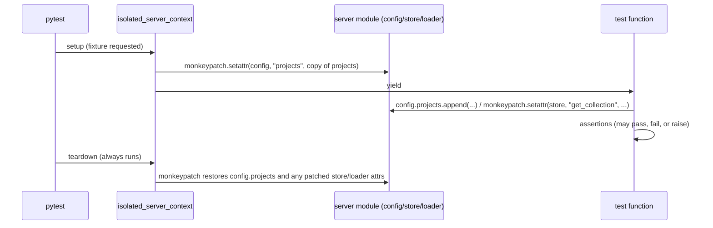

# Design Document

## Overview

This feature turns the `pow-rag-mcp` test suite from an untracked, flat, partially-broken
pile of 19 files into a **committed, goal-organized, green-on-a-fresh-Linux-checkout**
pytest suite. Nothing here changes runtime behavior of the MCP server or indexer except for
one real bug fix (`ProjectAutoDetector._apply_stack_rules`) uncovered by the failing tests.
Four concerns are in scope:

1. **Version control** — un-ignore `tests/` in `.gitignore` (keeping `__pycache__/` and
   `.pytest_cache/` excluded) and commit every test file, so `pytest` on a fresh clone
   collects the suite instead of exiting 5 ("no tests ran").
2. **Reorganization** — move the 19 flat files into 5 goal-based subpackages
   (`packaging/`, `server/`, `mcp_tools/`, `indexing/`, `config/`), each with `__init__.py`,
   fixing every `sys.path.insert`/`Path(__file__).parent.parent` repo-root calculation that
   breaks when a file moves one directory level deeper — without changing the collected
   test count.
3. **Data-driven conversion** — collapse groups of near-identical, hand-duplicated test
   functions (same function-under-test, same setup/assertion shape, differing only in
   literal input/expected values) into `pytest.mark.parametrize` tables, preserving every
   case.
4. **Fixing 20 failing tests** across four root causes: hardcoded machine-specific
   fixtures, a real bug in the C/C++ auto-detector's rule evaluation, shared mutable
   server-singleton state causing order dependence, and a flaky 30s timing assertion — plus
   making the whole thing runnable, network-free, and order-independent in GitHub Actions
   on a Linux runner with no local ChromaDB data.

Investigation confirmed (by reading the current test files, `src/rag_mcp/auto_detector.py`,
`config/detection_rules.json`, `server.py`, and `.github/workflows/release.yml` directly)
that all 20 failures are real, in-repo issues — not leftover contamination from a
differently-named checkout path, and not flakiness that should merely be documented away.

## Architecture

### Target folder structure

```mermaid
graph TD
    T["tests/ (__init__.py)"] --> PKG["packaging/ (__init__.py)"]
    T --> SRV["server/ (__init__.py)"]
    T --> MCP["mcp_tools/ (__init__.py)"]
    T --> IDX["indexing/ (__init__.py)"]
    T --> CFG["config/ (__init__.py)"]

    PKG --> pkg1[test_packaging.py]
    PKG --> pkg2[test_license_file.py]
    PKG --> pkg3[test_docs_content.py]
    PKG --> pkg4[test_check_release_version.py]
    PKG --> pkg5[test_check_release_version_cli.py]

    SRV --> srv1[test_mcp_connection.py]
    SRV --> srv2[test_server_name.py]
    SRV --> srv3[test_http_path.py]
    SRV --> srv4[test_setup_process.py]

    MCP --> mcp1[test_mcp_tools.py]
    MCP --> mcp2[test_add_file_folder.py]
    MCP --> mcp3[test_add_pattern.py]
    MCP --> mcp4[test_remove_project.py]
    MCP --> mcp5[test_clear_project_index.py]
    MCP --> mcpc["conftest.py (new — isolation fixture)"]

    IDX --> idx1[test_chunker.py]
    IDX --> idx2[test_file_reader.py]
    IDX --> idx3[test_auto_detector.py]
    IDX --> idx4[test_reranker.py]

    CFG --> cfg1[test_config_loader.py]
```



### CI pipeline (unchanged job graph, now able to actually run)

```mermaid
sequenceDiagram
    participant GH as GitHub Actions runner (Linux, fresh checkout)
    participant PY as pytest process (sys.executable)
    participant FS as tests/ (tracked, reorganized)

    GH->>GH: actions/checkout (no .venv, no data/, no __pycache__)
    GH->>PY: python -m pip install -e ".[dev]"; pytest
    PY->>FS: collect tests/**/test_*.py (via tests/__init__.py packages)
    loop each test module
        PY->>FS: run tests (no -x — continues past individual failures)
    end
    PY-->>GH: single pass/fail summary after the full run
    Note over GH,PY: exit code 0 required for build/publish jobs to proceed
```

Nothing about the `test` job's *steps* changes (Requirement 8 is satisfied by fixing the
tests themselves plus the `tests/` tracking gap); the design below shows exactly what makes
each acceptance criterion true.

## Components and Interfaces

### 1. `.gitignore` — track `tests/`, keep caches ignored

Today's `.gitignore` has no entry naming `tests/` directly, but the blanket cache rules
double as an accidental "everything under tests is untracked" state only in the sense that
`tests/` was never `git add`-ed in the first place (confirmed: no `tests/` line exists in
`.gitignore`, so this is a one-time `git add tests/` + commit, not a pattern removal). The
two cache patterns that must keep excluding files **under** `tests/` already do, because
they are unanchored:

```gitignore
__pycache__/
.pytest_cache/
```

No `.gitignore` edit is needed for Requirement 1.2 — `__pycache__/` and `.pytest_cache/`
already match at any depth, including `tests/__pycache__/` and any future
`tests/<subdir>/__pycache__/`. The only action is committing the (reorganized) `tests/`
tree, verified by `git ls-files tests/` matching the on-disk `*.py` file list exactly
(Requirement 1.3).

### 2. Test Folder Structure — exact file → folder mapping

All 19 current files are explicitly named in Requirement 2.1, so the ambiguous-file
tie-break rule (Requirement 2.6) does not apply to any file in today's tree — it is
recorded here only as a rule for contributors adding new files later.

| New path | Old path | Rationale |
|---|---|---|
| `tests/packaging/test_packaging.py` | `tests/test_packaging.py` | Packaging metadata (`pyproject.toml`, XDG paths, CLI) |
| `tests/packaging/test_license_file.py` | `tests/test_license_file.py` | License file content/presence |
| `tests/packaging/test_docs_content.py` | `tests/test_docs_content.py` | README/doc content checks tied to the release |
| `tests/packaging/test_check_release_version.py` | `tests/test_check_release_version.py` | SemVer/release-gate property tests |
| `tests/packaging/test_check_release_version_cli.py` | `tests/test_check_release_version_cli.py` | CLI wrapper for the same release-gate logic |
| `tests/server/test_mcp_connection.py` | `tests/test_mcp_connection.py` | Server startup/handshake/tool-listing integration |
| `tests/server/test_server_name.py` | `tests/test_server_name.py` | Server identity / mcp.json naming |
| `tests/server/test_http_path.py` | `tests/test_http_path.py` | HTTP transport endpoint configuration |
| `tests/server/test_setup_process.py` | `tests/test_setup_process.py` | Setup/mcp.json merge + startup-timing + concurrency |
| `tests/mcp_tools/test_mcp_tools.py` | `tests/test_mcp_tools.py` | MCP tool call behavior (search/find/compare/add_project) |
| `tests/mcp_tools/test_add_file_folder.py` | `tests/test_add_file_folder.py` | `add_file`/`add_folder` MCP tools |
| `tests/mcp_tools/test_add_pattern.py` | `tests/test_add_pattern.py` | `add_pattern` MCP tool |
| `tests/mcp_tools/test_remove_project.py` | `tests/test_remove_project.py` | `remove_project` MCP tool |
| `tests/mcp_tools/test_clear_project_index.py` | `tests/test_clear_project_index.py` | `clear_project_index` MCP tool |
| `tests/indexing/test_chunker.py` | `tests/test_chunker.py` | Chunking algorithm |
| `tests/indexing/test_file_reader.py` | `tests/test_file_reader.py` | File reading/encoding/hashing |
| `tests/indexing/test_auto_detector.py` | `tests/test_auto_detector.py` | Project structure auto-detection |
| `tests/indexing/test_reranker.py` | `tests/test_reranker.py` | Cross-encoder reranking of search results |
| `tests/config/test_config_loader.py` | `tests/test_config_loader.py` | `config.yaml` loading/validation |

New files: `tests/__init__.py` (already exists — kept), plus a new, empty
`__init__.py` in each of the five subdirectories (Requirement 2.4). A new
`tests/mcp_tools/conftest.py` is added (see Component 6) — not a move, a new file scoped to
the one subpackage that has shared-state isolation needs.

### Path-resolution fix (Requirement 2.3)

Every affected file computes the repository root as `Path(__file__).parent.parent` (two
levels up from `tests/<file>.py`). Moving one directory level deeper means every such
expression needs exactly one more `.parent`:

| File (new location) | Old expression | New expression |
|---|---|---|
| `mcp_tools/test_add_file_folder.py` | `Path(__file__).parent.parent` (×2: `/"src"` and bare) | `Path(__file__).parent.parent.parent` |
| `mcp_tools/test_mcp_tools.py` | same (×2) | same fix |
| `mcp_tools/test_remove_project.py` | same (×2) | same fix |
| `mcp_tools/test_clear_project_index.py` | same (×2) | same fix |
| `indexing/test_auto_detector.py` | `Path(__file__).parent.parent / "src"` | `Path(__file__).parent.parent.parent / "src"` |
| `indexing/test_chunker.py` | same | same fix |
| `indexing/test_file_reader.py` | same | same fix |
| `indexing/test_reranker.py` | same | same fix |
| `config/test_config_loader.py` | same | same fix |
| `server/test_mcp_connection.py` | `SCRIPT_DIR = Path(__file__).parent.parent` | `SCRIPT_DIR = Path(__file__).parent.parent.parent` |
| `server/test_setup_process.py` | same | same fix |
| `server/test_http_path.py` | same | same fix |
| `server/test_server_name.py` | `SCRIPT_DIR = Path(__file__).parent.parent` | same fix |
| `packaging/test_packaging.py` | `REPO_ROOT = Path(__file__).parent.parent` | `REPO_ROOT = Path(__file__).parent.parent.parent` |
| `packaging/test_license_file.py` | same | same fix |
| `packaging/test_docs_content.py` | same | same fix |
| `packaging/test_check_release_version.py` | same | same fix |
| `packaging/test_check_release_version_cli.py` | same | same fix |

`tests/add_pattern.py` needs no change — it never computes a repo-root path; it imports
`rag_mcp.*` directly, relying on `pytest.ini`'s `pythonpath = src`, which is depth-independent.
Every corrected file is verified by an assertion that the computed root actually resolves to
the true repository root, e.g. `(REPO_ROOT / "pyproject.toml").exists()` — proof that the
literal `.parent` count is correct for that file's new depth, not just that the file happens
to import successfully.

### 3. Data-driven test conversions

Applying the same-function/same-shape/differing-literals test from Requirement 3.1 to the
current suite identifies five groups where converting to `pytest.mark.parametrize`
eliminates duplication without dropping cases (Requirement 3.2) or touching functions that
exercise different logic (Requirement 3.4/3.5):

| Module | Functions merged | Parametrize axis | Cases preserved |
|---|---|---|---|
| `config/test_config_loader.py` | `test_invalid_log_pattern_regex_raises`, `test_invalid_line_filter_regex_raises`, `test_invalid_content_transform_regex_raises`, `test_invalid_grouping_rule_start_pattern_raises`, `test_invalid_grouping_rule_continuation_pattern_raises` | `(log_patterns_snippet \| log_settings_snippet, expected_match_regex)` | 5 |
| `config/test_config_loader.py` | `test_log_settings_numeric_range_validation`, `test_log_settings_dedup_threshold_too_low` | `(log_settings_snippet, expected_match_regex)` | 2 |
| `packaging/test_docs_content.py` | `test_readme_contains_distribution_name`, `test_readme_contains_uvx_command`, `test_readme_contains_uv_tool_install_command`, `test_readme_contains_pip_install_command`, `test_readme_contains_requires_python_version` | `expected_substring` | 5 |
| `mcp_tools/test_add_pattern.py::TestAddPatternValidation` | `test_invalid_type_returns_error`, `test_missing_project_returns_error`, `test_empty_project_returns_error`, `test_empty_pattern_returns_error`, `test_removed_project_returns_error` | `(project, pattern, type, expected_substring)` | 5 |
| `indexing/test_auto_detector.py` | `test_detect_cpp_flat_c_fontes`, `test_detect_cpp_nested_c_fontes`, `test_detect_python_project`, `test_detect_go_project`, `test_detect_node_project`, `test_detect_common_docs` | `(files_to_create: dict[str, str], expected_patterns: list[str])` | 6 |
| `server/test_http_path.py` | `test_env_var_overrides_path` + `test_env_var_custom_paths`, `test_fastmcp_receives_custom_path` + `test_fastmcp_receives_default_path`, `test_startup_log_includes_custom_path` + `test_startup_log_default_path` | `(env_value: str \| None, expected_path: str)` per group | 5 / 2 / 2 |
| `server/test_server_name.py` | `test_server_name_empty_string_override_falls_back_to_file`, `test_server_name_none_override_falls_back_to_file` | `override` (`""` or `None`) | 2 |

`test_auto_detector.py::test_detect_empty_dir_returns_empty` and `test_detect_gitmodules`
stay separate: the former asserts `sources == []` (equality, not a subset-contains check —
different assertion shape) and the latter's setup (parsing `.gitmodules`, walking a
submodule directory) exercises `_detect_submodules`, a different function-under-test, per
Requirement 3.4. Each parametrized test uses an explicit `ids=[...]` (or a descriptive
first tuple element) so a failing case's pytest node ID names the distinguishing input
(Requirement 3.3), e.g. `test_detect_project_layout[cpp_flat_c_fontes]`.

### 4. Fixing hardcoded environment fixtures (Requirement 4)

`tests/mcp_tools/test_add_file_folder.py` and `tests/mcp_tools/test_mcp_tools.py` hardcode
`C:/Users/you/GIT/my-project/...` paths and assume pre-indexed collections (`my-project`,
`my-project-a`, `my-project-b`) and a pre-indexed function (`MyFunction`) / hex code
(`AAa7676`) that only exist on one developer's machine. The fix is the same shape for every
affected test: build the fixture inside the test, index it into an isolated project, run the
assertion, then remove the project.

```python
# tests/mcp_tools/test_add_file_folder.py (corrected shape)
@pytest.fixture
def indexed_project(tmp_path, isolated_server_context):
    """Creates and indexes a throwaway project; guarantees removal afterward."""
    project_dir = tmp_path / "sample_project"
    (project_dir / "docs").mkdir(parents=True)
    (project_dir / "docs" / "README.md").write_text("# Sample\nContent for indexing.\n")
    name = f"test-add-file-{uuid.uuid4().hex[:8]}"
    result = _add_project_sync(name, str(project_dir))
    assert not result.startswith("Error")
    yield name, project_dir
    server.config.projects = [p for p in server.config.projects if p.name != name]
    server.store.delete_collection(name)


def test_add_file_valid(indexed_project):
    name, project_dir = indexed_project
    readme = project_dir / "docs" / "README.md"
    result = _add_file_sync(str(readme), name)
    assert not result.startswith("Error")
    assert "indexed" in result.lower()
```

The same pattern replaces `PROJECT_A`/`PROJECT_B`/`SAMPLE_FUNCTION`/`SAMPLE_HEX_CODE` in
`test_mcp_tools.py`: a fixture indexes two throwaway projects (each with a known function
name and a known hex-looking token written into a source file it controls), yields their
generated names, and removes both collections/config entries on teardown — regardless of
whether the test passed, matching Requirement 4.5. Because the fixture builds the content
the test later searches for, every assertion (`SAMPLE_FUNCTION in result`, hex code found,
etc.) is checked against data the test itself created, satisfying Requirement 4.2/4.3 (no
survivable hardcoded path/project/function/hex-code reference). Validation-only cases that
never touched a real fixture (empty query, empty name, non-existent project) are unaffected
— they already used no environment dependency and are left as-is (or merged into the
parametrize tables from Component 3 where their shape matches).

### 5. Auto-detector bug fix (Requirement 5)

**Root cause, confirmed by reading the code and both rule files:**

`ProjectAutoDetector` loads rules from `config/detection_rules.json` by default
(`_DEFAULT_RULES_PATH` in `src/rag_mcp/auto_detector.py`). Comparing that file against the
packaged copy at `src/rag_mcp/data/detection_rules.json` (kept in sync by
`scripts/sync_package_data.py`, which copies **from** `config/` **to** `src/rag_mcp/data/`)
shows the canonical `config/detection_rules.json` is missing two things that only exist in
the packaged copy — meaning someone edited the packaged output directly instead of the
source of truth:

**A second, independent defect exists in the code itself**, in
`ProjectAutoDetector._apply_stack_rules` (`src/rag_mcp/auto_detector.py`), that would still
produce wrong results even after the data is restored. The current branch:

```python
if has_direct:
    patterns = rule.get("patterns_if_direct", [])
else:
    patterns = rule.get("patterns_if_nested", [])   # BUG: assumes "not direct" ⇒ "nested"
```

treats "no direct files" as proof of "nested files exist," so a `check_dir` that exists but
contains **no matching files at all** (neither directly nor in a subfolder) still returns
`patterns_if_nested` — violating Requirement 5.3's explicit third clause ("return
`patterns_if_nested` ... when ... at least one file matching ... exists in a subfolder").

**Corrected algorithm** (pseudocode; the real fix reuses the existing `_has_files_recursive`
helper, which already excludes `node_modules`/`venv`/etc., as the nested check — no new glob
logic needed):

```
for rule in stack_rules:
    if not rule_matches(project_path, rule):        # unchanged — Req 5.4 already correct here
        continue

    if "has_direct_files" in rule:
        check_dir = rule.check_dir[0] if rule.check_dir else None
        dir_path  = project_path / check_dir if check_dir else project_path
        glob_patterns = rule.has_direct_files

        has_direct = any(has_files(dir_path, g) for g in glob_patterns)          # non-recursive
        if has_direct:
            patterns = rule.patterns_if_direct
        else:
            has_nested = any(has_files_recursive(dir_path, g) for g in glob_patterns)  # FIX: verify, don't assume
            patterns = rule.patterns_if_nested if has_nested else []            # FIX: neither ⇒ no patterns
    else:
        patterns = rule.patterns

    sources += patterns
```

`rule_matches`'s existing directory-existence short-circuit (`check_dir` must be an existing
directory or the rule doesn't match at all) already satisfies Requirement 5.4 unchanged —
that half of the algorithm was already correct; only the direct/nested/neither branch inside
`_apply_stack_rules` needs the fix above. Because `has_direct=False` already guarantees no
file matches directly inside `dir_path`, any `rglob` match found by `has_files_recursive`
must be at depth ≥ 1 (a genuine subfolder match), so no extra exclusion logic is needed
beyond the helper that already exists.


After this change, `scripts/sync_package_data.py` is re-run (as it already is before every
wheel build, per its own docstring) so `src/rag_mcp/data/detection_rules.json` — now
identical in content, generated from the corrected canonical file rather than drifted ahead
of it — stays in sync.

### 6. Shared-server-context isolation fixture (Requirement 6)

`tests/mcp_tools/test_clear_project_index.py` and `test_remove_project.py` mutate
module-level `server.config.projects`, `server.store.get_collection`/`delete_collection`,
and `server.loader.save` directly, restoring each one by hand in a `finally` block. The
manual restoration is easy to get subtly wrong (e.g. cleanup running before an assertion
that itself throws, or two tests racing to clean up the same fixture name) and is exactly
the kind of thing pytest's built-in `monkeypatch` fixture already does correctly — snapshot
on first use, restore unconditionally at teardown, regardless of pass/fail/exception. A new
`tests/mcp_tools/conftest.py` centralizes this:

```python
# tests/mcp_tools/conftest.py
import pytest
import server  # already on sys.path via pytest.ini's pythonpath = src + the module's own insert


@pytest.fixture
def isolated_server_context(monkeypatch):
    """Isolates mutations to the Shared_Server_Context for one test.

    Rebinding `server.config.projects` to a *copy* of the current list means any
    append/remove the test (or the code it calls) performs happens on the copy —
    the original list object is untouched. `monkeypatch` restores the attribute
    to the original list reference during its own teardown, unconditionally
    (pass, fail, or raised exception), which is exactly Requirement 6.1's
    "restore ... regardless of whether the test passed or failed."

    Any store/loader method a test replaces (`server.store.get_collection`,
    `server.store.delete_collection`, `server.loader.save`, etc.) should be
    patched via this same `monkeypatch` fixture rather than hand-saved
    originals, so it is restored by the identical mechanism.
    """
    monkeypatch.setattr(server.config, "projects", list(server.config.projects))
    yield
```

Every test in the two affected modules takes `isolated_server_context` as a fixture
argument (or the module sets `pytestmark = pytest.mark.usefixtures("isolated_server_context")`)
and replaces its manual `original = server.store.get_collection; ...; finally: server.store.get_collection = original`
blocks with a single `monkeypatch.setattr(server.store, "get_collection", MagicMock(...))`
call. `test_removes_project_from_config` additionally switches from a hardcoded
`"test_removable"` name to a per-test-unique name (`f"test-removable-{uuid.uuid4().hex[:8]}"`)
so two tests (or the same test run three times in sequence, or in random order) never
collide on the same in-memory project name — satisfying Requirement 6.2's "without relying
on any mutation performed by another test" and Requirement 6.3's three-sequential-runs-plus-
randomized-order pass criterion.



### 7. Flaky startup-timing fix (Requirement 7)

`tests/server/test_mcp_connection.py` currently asserts `startup_time < 30` twice (once
right after `session.initialize()`, once again at the end of the same test using the same
already-captured `startup_time` value — a genuinely duplicate check, not a second
measurement). The fix: raise the bound to 60 seconds, keep exactly one assertion, and
include the measured value in the failure message (already the existing message format,
just with the updated bound):

```python
assert startup_time < 60, f"Server took {startup_time:.1f}s to initialize (limit: 60s)"
```

The second, duplicate `assert startup_time < 30, ...` block (currently comment-labeled
`# --- 10. Startup time check (already measured) ---`) is deleted outright rather than
updated, satisfying Requirement 7.3's "exactly once."

### 8. CI / cross-platform hygiene (Requirement 8)

- `tests/server/test_mcp_connection.py` and `tests/server/test_setup_process.py` currently
  compute `PYTHON_EXE = SCRIPT_DIR / ".venv" / "Scripts" / "python.exe"` and fall back to
  `sys.executable` only if that Windows-specific path doesn't exist. The fix removes the
  `.venv` branch entirely and uses `sys.executable` unconditionally — the interpreter already
  running pytest is guaranteed to have every dev dependency installed (`pip install -e
  ".[dev]"` in the CI workflow), so there is nothing the `.venv` path was adding except a
  Windows-only fallback that happens to also work locally.
- No workflow YAML change is needed for Requirements 8.4/8.5 (continue past failures, report
  once at the end) — `pytest` already does this by default; the existing `test` job step
  (`run: pytest`) passes no `-x`/`--maxfail` flag, so this is confirmed by inspection rather
  than a code change.
- `test_http_path.py`'s three "live HTTP" tests (`test_live_default_path_responds`,
  `test_live_wrong_path_returns_404`, `test_live_server_name_is_rag_mcp`) already
  `pytest.skip()` when no container is reachable at `localhost:8001` — on a fresh CI runner
  with no container running, they skip rather than fail or hang, satisfying "no live network
  call required to pass" (Requirement 8.2) without needing to delete or gate them further.

## Data Models

This feature has no runtime data models — it is test-file layout, pytest configuration, one
JSON rules-file correction, and one small algorithmic fix in an existing pure function. The
only structured "data" introduced is the isolation-fixture's snapshot, which is simply
`list(server.config.projects)` — a shallow copy of the existing `list[ProjectConfig]` — and
the `DetectedSource` dataclass already defined in `auto_detector.py` (`pattern: str, type:
str, description: str`), unchanged by this feature.

## Correctness Properties

*A property is a characteristic or behavior that should hold true across all valid executions
of a system-essentially, a formal statement about what the system should do. Properties
serve as the bridge between human-readable specifications and machine-verifiable correctness
guarantees.*

Per the prework analysis, almost every acceptance criterion in this feature describes a
one-time repository-hygiene fact, a fixed enumerable file-to-folder mapping, or a
refactoring judgment call about the current, fixed set of test files — none of which vary
meaningfully across a generated input space, so property-based testing does not apply to
them (they are covered by example-based, smoke, edge-case, and integration tests instead;
see Testing Strategy). The sole exception is `ProjectAutoDetector`'s rule-evaluation logic
(Requirement 5), which is a pure function over a genuinely large input space — which files
exist, at which depth, under a scanned directory — and is exactly the kind of parser/detector
logic this project's own testing conventions call out for property-based coverage.

### Property 2: A missing `check_dir` never contributes patterns

*For any* rule defining `has_direct_files`, `patterns_if_direct`, and `patterns_if_nested`
whose `check_dir` does not exist as a directory under the scanned project path,
`ProjectAutoDetector` SHALL NOT match that rule and SHALL NOT return any pattern from either
`patterns_if_direct` or `patterns_if_nested` for it, regardless of what files exist elsewhere
in the project.

## Error Handling

| Failure point | Detection | Behavior |
|---|---|---|
| `tests/` still excluded or partially untracked after this change | `git ls-files tests/` vs. on-disk `*.py` walk (repo-hygiene check) | Fails the check with the list of untracked files; caught before merge, not at CI runtime |
| A moved test file's repo-root calculation is off by one `.parent` | The file's own top-level import (`from rag_mcp... import ...` / `import server`) raises `ModuleNotFoundError` at collection time | pytest reports a collection error for that module; the explicit `(REPO_ROOT / "pyproject.toml").exists()` assertion added per file catches a *wrong-but-still-importable* root before it causes a harder-to-diagnose downstream failure |
| Reorganization silently drops or duplicates a test function | `pytest --collect-only -q` count before vs. after (Requirement 2.5) | Any mismatch is caught immediately by the collected-count diff, before the reorganization is considered complete |
| A parametrize conversion drops a case that existed in the original functions | Case count in the `@pytest.mark.parametrize` table vs. the original function count (Component 3 table) | Table construction is derived directly from the original functions being replaced, one row per original test, so a dropped case shows up as a missing table row during review |
| An `mcp_tools/` test still references a hardcoded path/project/function/hex code after "fixing" | Requirement 4.3's definition — grep for the specific literal strings (`C:/`, `my-project`, `MyFunction`, `AAa7676`) in the corrected files | Treated as not-corrected; the fixture-based rewrite in Component 4 replaces every one of these literals with test-generated values, so none should remain |
| `add_project`/indexing inside a test fixture fails (e.g. bad tmp_path permissions) | The fixture's own `assert not result.startswith("Error")` right after calling `_add_project_sync` | Fixture setup fails fast with a clear message before the test body runs, rather than the test body failing on an unrelated missing-fixture symptom |
| A fixture-indexed project is not cleaned up because the test raised before reaching manual cleanup code | Previously: silent leak into `server.config.projects`/ChromaDB, corrupting later tests. Now: pytest fixture teardown (`yield` + cleanup, or `monkeypatch`) | Teardown code runs unconditionally after `yield`, whether the test passed, failed an assertion, or raised — this is pytest's own fixture-teardown guarantee, exercised directly in Component 4/6 |
| Auto-detector `check_dir` exists but is completely empty | Property 1's "neither" branch | Returns no patterns from that rule (the fix) rather than incorrectly returning `patterns_if_nested` (the bug) |
| `config/detection_rules.json` drifts from `src/rag_mcp/data/detection_rules.json` again in the future | `scripts/sync_package_data.py`, re-run before every wheel build per its own docstring | Overwrites the packaged copy from the canonical `config/` source, so drift is corrected on the next sync rather than accumulating |
| Two `mcp_tools/` tests mutating `server.config.projects` run in an order that exposes leftover state | `isolated_server_context` fixture (Component 6), verified by running the affected tests 3x sequentially and once with randomized order (Requirement 6.3) | `monkeypatch` restores `server.config.projects` (and any patched `store`/`loader` attribute) after every test regardless of order or outcome |
| Server subprocess genuinely takes ≥60s to start (real regression, not environment noise) | The single `assert startup_time < 60, f"...{startup_time:.1f}s..."` in `test_mcp_connection.py` | Test fails and reports the actual measured seconds in the failure message, aiding diagnosis (Requirement 7.2) |
| A test hardcodes `.venv/Scripts/python.exe` and that path doesn't exist on the CI Linux runner | Previously: silently fell back to `sys.executable` only via an `if PYTHON_EXE.exists()` check that itself depends on Windows path semantics | Fix removes the branch entirely — `sys.executable` unconditionally, so there is no path to detect a failure on because the failure mode no longer exists |
| A live-HTTP test in `test_http_path.py` runs in CI with no container listening on `localhost:8001` | Existing `pytest.skip(f"Container not reachable at {url}: {e}")` inside `_mcp_initialize` | Test is reported as skipped, not failed or hung — already correct, confirmed unchanged by this feature |

## Testing Strategy

**Property-based tests** (`tests/indexing/test_auto_detector.py`, using `hypothesis`,
already a `dev`-group testing convention in this codebase per the `pypi-package-publishing`
spec's `test_check_release_version.py` — minimum 100 examples via
`@settings(max_examples=100)`):

- Generators build a synthetic project directory (`tmp_path`) with a `check_dir`-like folder
  containing zero, one, or several files matching a glob at depth 0 (direct), depth ≥1
  (nested), or matching-nothing, so Property 1's three branches are all exercised by varying
  which depth(s) get populated.
- A second generator builds directories where the target `check_dir` path is never created
  at all (Property 2), alongside sibling directories/files that must be ignored regardless
  of what's inside them.
- 
```python
# tests/indexing/test_auto_detector.py
from hypothesis import given, settings, strategies as st


**Unit / example-based tests** (everything else — per the prework analysis, static
file-content facts, fixed enumerable mappings, and refactoring judgment calls about the
current file set are not meaningfully varied by input, so example-based/smoke checks are the
right tool):

- Repo-hygiene checks: `.gitignore` still excludes `__pycache__/`/`.pytest_cache/` and no
  longer excludes `tests/`; `git ls-files tests/` matches the on-disk `*.py` list; every one
  of the 19 files exists at its Requirement-2.1 destination and no longer at its old flat
  path; `__init__.py` exists in `tests/` and each of the 5 subdirectories.
- Path-resolution checks: for each moved file, `(computed_repo_root /
  "pyproject.toml").exists()` (or `/ "config" / "detection_rules.json"` for `src`-relative
  cases) — proves the updated `.parent` count is correct, not just importable.
- The isolation fixture (`isolated_server_context`) gets three direct unit tests of its own:
  teardown restores `server.config.projects` after a test that passes, after a test that
  fails an assertion, and after a test that raises an unexpected exception — covering
  Requirements 4.5/6.1's "regardless of whether the test passed or failed" as concrete edge
  cases rather than a generated property, since the input space (pass/fail/raise) is
  intentionally small and finite.
- `test_remove_project.py`/`test_clear_project_index.py`: each corrected test creates a
  uniquely-named project (`uuid.uuid4().hex[:8]` suffix), asserts `removed is True` and
  `list_projects()` excludes it post-removal (Requirement 6.2), and is run — as a one-time
  verification step, not a repeated CI gate — three times in sequence plus once under
  `pytest -p randomly` to confirm order-independence (Requirement 6.3).
- `test_mcp_connection.py`: single `startup_time < 60` assertion with the measured value in
  the failure message; the corrected `mcp_tools/` fixture-based tests from Component 4; the
  parametrized tables from Component 3.
- CI/integration-level checks (verified by the actual `.github/workflows/release.yml` `test`
  job run, not as pytest unit tests): collecting ≥1 test on a fresh checkout (Requirement
  1.5), the full suite completing with exit code 0 (Requirement 8.1), continuing past
  individual failures and reporting once at the end (Requirements 8.4, 8.5 — confirmed by
  inspection: no `-x`/`--maxfail` flag in the workflow step), and zero regressions among
  previously-passing tests (Requirement 8.6, verified by diffing the pre-fix 156-passing
  baseline against the post-fix fresh-checkout run).
