# Implementation Plan: Test Suite Reorganization

## Overview

This plan turns the untracked, flat test `tests/` directory into a
committed, goal-organized, green-on-a-fresh-Linux-checkout pytest suite. Work proceeds in
seven tracks: (1) version control, (2) folder reorganization + path-resolution fixes,
(3) data-driven parametrize conversions, (4) hardcoded-fixture fixes in `mcp_tools/`,
(5) the shared-server-state isolation fixture, (6) the flaky startup-timing assertion,
and (7) CI/cross-platform hygiene. Track 2 (the move) must land before tracks 3-6, since
those tracks edit files at their post-move paths. Each task carries a `Model:` annotation
recommending which LLM capability tier to use.

Grounded directly against the current repo state:
- `git status --porcelain -- tests/ .gitignore` confirms `tests/` is fully untracked and
  `.gitignore` in the working tree already has its `tests/` line removed (uncommitted) —
  Task 1 verifies/commits this rather than re-doing it.
- `pyproject.toml`'s `dev` extra has `pytest`, `pytest-asyncio`, `hypothesis` but no
  randomized-order plugin — Requirement 6.3's "randomized test order" verification needs one
  added.

## Tasks

- [x] 1. Track `tests/` in version control
  - [x] 1.1 Verify and commit the `.gitignore` change and the `tests/` tree
    - Confirm `.gitignore` no longer excludes `tests/`, any file under it, or any of its
      subdirectories, while still excluding `__pycache__/` and `.pytest_cache/` (both already
      match unanchored, at any depth)
    - Stage the full current `tests/` tree (19 `test_*.py` files + `__init__.py`) with
      `git add` so it is tracked, ready for the user to commit — do not run `git commit`
      yourself; committing is the user's call, not this task's
    - Run `pytest --collect-only -q` and record the total collected test count (used as the
      Requirement 2.5 baseline for Task 2's verification)
    - _Requirements: 1.1, 1.2, 1.3, 1.4, 1.5_
    - Model: Qwen3 Coder Next (mechanical git/gitignore verification, no logic; 0.05x credit)

- [x] 2. Reorganize `tests/` into goal-based subdirectories
  - [x] 2.1 Create the five subdirectory packages
    - Create `tests/packaging/`, `tests/server/`, `tests/mcp_tools/`, `tests/indexing/`,
      `tests/config/`, each with an empty `__init__.py`; keep the existing `tests/__init__.py`
    - Add a short docstring to `tests/__init__.py` documenting the Requirement 2.6 tie-break
      rule for contributors adding a new test file later: if a new file covers more than one
      goal area, place it in the subdirectory matching the largest number of test functions
      for that area, break ties by the subdirectory listed earliest in this docstring's list
      (`packaging`, `server`, `mcp_tools`, `indexing`, `config`), and record the placement
      rationale (areas considered + counts) in the new file's own module docstring
    - _Requirements: 2.1, 2.4, 2.6_
    - Model: Qwen3 Coder Next (directory/file scaffolding plus a short docstring; 0.05x credit)

  - [x] 2.2 Move all 19 test files to their new subdirectories (use `git mv` to preserve history)
    - `packaging/`: `test_packaging.py`, `test_license_file.py`, `test_docs_content.py`,
      `test_check_release_version.py`, `test_check_release_version_cli.py`
    - `server/`: `test_mcp_connection.py`, `test_server_name.py`, `test_http_path.py`,
      `test_setup_process.py`
    - `mcp_tools/`: `test_mcp_tools.py`, `test_add_file_folder.py`, `test_add_pattern.py`,
      `test_remove_project.py`, `test_clear_project_index.py`
    - `indexing/`: `test_chunker.py`, `test_file_reader.py`, `test_auto_detector.py`,
      `test_reranker.py`
    - `config/`: `test_config_loader.py`
    - Do not edit file contents in this sub-task — moves only, so the diff is a pure rename
    - _Requirements: 2.1, 2.2_
    - Model: Qwen3 Coder Next (pure file moves per an explicit, unambiguous mapping table;
      0.05x credit)

  - [x] 2.3 Fix repo-root path-resolution expressions for the new depth
    - In each of the 18 moved files that computes a repo-root-relative or `src`-relative path
      (every file except `mcp_tools/test_add_pattern.py`, which has no such computation),
      add exactly one more `.parent` to every `Path(__file__).parent.parent` /
      `SCRIPT_DIR = Path(__file__).parent.parent` / `REPO_ROOT = Path(__file__).parent.parent`
      expression, per the old-expression → new-expression table in `design.md`
    - `mcp_tools/test_add_file_folder.py`, `mcp_tools/test_mcp_tools.py`,
      `mcp_tools/test_remove_project.py`, `mcp_tools/test_clear_project_index.py` each have
      two such `sys.path.insert(...)` lines (one for `/"src"`, one bare) — fix both
    - After fixing each file, add or update an assertion that the computed root actually
      resolves to the true repo root (e.g. `assert (SCRIPT_DIR / "pyproject.toml").exists()`
      or the `src`-relative equivalent), proving the `.parent` count is correct rather than
      merely importable
    - _Requirements: 2.3_
    - Model: Claude Sonnet 5 (mechanical but must be applied correctly per-file with a
      verifying assertion, not just "add a .parent and hope"; 1.3x credit)

  - [x] 2.4 Verify collected test count is unchanged and commit the reorganization
    - Run `pytest --collect-only -q` from the repo root and confirm the total matches the
      Task 1.1 baseline exactly (no test function or class added/removed/renamed)
    - Fix any `ModuleNotFoundError` surfaced at collection time (a missed `.parent` from 2.3)
    - Leave the moves + path fixes staged for the user to commit — do not run `git commit`
      yourself
    - _Requirements: 2.2, 2.5_
    - Model: Qwen3 Coder Next (running a command and diffing a count; 0.05x credit)

- [x] 3. Checkpoint - Ensure all tests still collect and the pre-existing pass/fail counts are unchanged
  - Run the full suite (`pytest`) and confirm exactly the same 156 passing / 20 failing / 3
    skipped as before the move (reorganization must not fix or break anything by itself).
    Ask the user if the counts differ unexpectedly.

- [x] 4. Convert repetitive test groups to `pytest.mark.parametrize`
  - [x] 4.1 Parametrize `config/test_config_loader.py`'s two invalid-regex-raises groups
    - Merge `test_invalid_log_pattern_regex_raises`, `test_invalid_line_filter_regex_raises`,
      `test_invalid_content_transform_regex_raises`,
      `test_invalid_grouping_rule_start_pattern_raises`,
      `test_invalid_grouping_rule_continuation_pattern_raises` into one
      `@pytest.mark.parametrize` test over `(config_snippet, expected_match_regex)`, preserving
      all 5 cases with descriptive `ids`
    - Merge `test_log_settings_numeric_range_validation` and
      `test_log_settings_dedup_threshold_too_low` into a second parametrized test over
      `(log_settings_snippet, expected_match_regex)`, preserving both cases
    - Leave `test_load_valid_config`, `test_load_missing_file_raises`, `test_save_and_reload`,
      `test_expand_path_tilde`, `test_expand_path_env_var`, `test_valid_log_patterns_regex`,
      `test_duplicate_log_pattern_name_raises`, `test_log_patterns_max_50_raises`,
      `test_invalid_event_type_format_raises`, `test_valid_line_filters_and_transforms_load`
      unparametrized — each exercises a distinct setup/assertion shape
    - _Requirements: 3.1, 3.2, 3.3, 3.4, 3.5_
    - Model: Claude Sonnet 5 (must preserve exact raise-match regexes per case while merging;
      1.3x credit)

  - [x] 4.2 Parametrize `packaging/test_docs_content.py`'s README substring checks
    - Merge `test_readme_contains_distribution_name`, `test_readme_contains_uvx_command`,
      `test_readme_contains_uv_tool_install_command`, `test_readme_contains_pip_install_command`,
      `test_readme_contains_requires_python_version` into one parametrized test over
      `expected_substring`, preserving all 5 literal substrings with descriptive `ids`
    - Leave `test_readme_consistency_with_pyproject_toml`,
      `test_pip_install_guide_has_public_pypi_heading`,
      `test_pip_install_guide_has_local_index_heading`,
      `test_pip_install_guide_headings_are_distinct` unparametrized (different assertion
      shapes / different target file)
    - _Requirements: 3.1, 3.2, 3.3, 3.4, 3.5_
    - Model: Qwen3 Coder Next (identical shape, literal substring axis only; 0.05x credit)

  - [x] 4.3 Parametrize `mcp_tools/test_add_pattern.py::TestAddPatternValidation`
    - Merge `test_invalid_type_returns_error`, `test_missing_project_returns_error`,
      `test_empty_project_returns_error`, `test_empty_pattern_returns_error`,
      `test_removed_project_returns_error` into one parametrized test over
      `(project, pattern, type, expected_substring)`, preserving all 5 cases (including the
      `removed=True` project fixture setup for the last case, expressed as a per-case
      callable/fixture-factory parameter rather than dropped)
    - Leave `TestAddPatternHappyPath`, `TestAddPatternNoMatch`, `TestAddPatternDuplicate`,
      `TestAddPatternSkipsUnreadable` classes unparametrized (each exercises distinct
      setup/mocking, not shared shape)
    - _Requirements: 3.1, 3.2, 3.3, 3.4, 3.5_
    - Model: Claude Sonnet 5 (one case needs a differently-shaped fixture, so the merge isn't
      purely mechanical; 1.3x credit)

  - [x] 4.4 Parametrize `indexing/test_auto_detector.py`'s per-stack detection tests
    - Merge `test_detect_python_project`, `test_detect_go_project`, `test_detect_node_project`,
      `test_detect_common_docs` into one parametrized test over
      `(files_to_create: dict[str, str], expected_patterns: list[str])`, preserving all 4
      cases with descriptive `ids`
    - Leave `test_detect_empty_dir_returns_empty` (asserts `sources == []`, an equality check
      rather than a subset-contains check) and `test_detect_gitmodules` (exercises
      `_detect_submodules`, a different function-under-test) unparametrized
    - _Requirements: 3.1, 3.2, 3.3, 3.4, 3.5_
    - Model: Claude Sonnet 5 (building a generic "create these files, assert these patterns"
      helper; 1.3x credit)

  - [x] 4.5 Parametrize `server/test_http_path.py`'s paired env-var/default tests
    - Merge `test_env_var_overrides_path` + `test_env_var_custom_paths` into one parametrized
      test over `(env_value, expected_path)` (5 cases: the single override plus the 4 items
      of `custom_paths`)
    - Merge `test_fastmcp_receives_custom_path` + `test_fastmcp_receives_default_path` into one
      parametrized test over `(env_value: str | None, expected_path)` (2 cases)
    - Merge `test_startup_log_includes_custom_path` + `test_startup_log_default_path` into one
      parametrized test over `(env_value: str | None, expected_path)` (2 cases)
    - Leave `test_default_path_is_slash_mcp`, `test_empty_env_var_falls_back_to_default`,
      and the three live-HTTP tests (`test_live_default_path_responds`,
      `test_live_wrong_path_returns_404`, `test_live_server_name_is_rag_mcp`) unparametrized
    - _Requirements: 3.1, 3.2, 3.3, 3.4, 3.5_
    - Model: Claude Sonnet 5 (three separate merge groups in one file, each with a `None`
      vs. `""` vs. real-string case to get right; 1.3x credit)

  - [x] 4.6 Parametrize `server/test_server_name.py`'s empty/None override tests
    - Merge `test_server_name_empty_string_override_falls_back_to_file` and
      `test_server_name_none_override_falls_back_to_file` into one parametrized test over
      `override` (`""` or `None`), preserving both cases
    - Leave every other test in the file (default read, non-empty override, `_write_entry`,
      docker-mode, native-mode, preservation, and update-not-duplicate tests) unparametrized
    - _Requirements: 3.1, 3.2, 3.3, 3.4, 3.5_
    - Model: Qwen3 Coder Next (two cases, identical shape, trivial merge; 0.05x credit)

- [x] 5. Checkpoint - Ensure all tests pass
  - Run `pytest --collect-only -q` and confirm the total collected count is unchanged from
    Task 3's baseline (parametrize conversions must add exactly as many parametrized cases as
    functions removed). Run the full suite and confirm the pass/fail split is unchanged.
    Ask the user if counts differ unexpectedly.

- [x] 6. Fix hardcoded environment fixtures in `mcp_tools/`
  - [x] 6.1 Replace hardcoded paths/project in `mcp_tools/test_add_file_folder.py`
    - Add a module-scoped or function-scoped fixture (e.g. `indexed_project`) that builds a
      throwaway project under `tmp_path` (a directory with at least one `.md` file), indexes
      it via `_add_project_sync` with a UUID-suffixed unique name, asserts the add succeeded,
      yields the project name and directory, and on teardown removes the project from
      `server.config.projects` and deletes its ChromaDB collection via
      `server.store.delete_collection`, regardless of whether the test passed or failed
    - Rewrite `test_add_file_valid`, `test_add_file_unknown_project`, `test_add_folder_valid`,
      `test_add_folder_outside_base`, `test_add_folder_no_matching_files` to use the fixture's
      generated project name/directory instead of the hardcoded `TEST_PROJECT = "my-project"`,
      `TEST_FILE = "C:/Users/you/GIT/my-project/README.md"`,
      `TEST_FOLDER = "C:/Users/you/GIT/my-project/tests"`
    - Leave `test_add_file_nonexistent`, `test_add_file_empty_path`,
      `test_add_file_empty_project`, `test_add_folder_nonexistent`,
      `test_add_folder_empty_path`, `test_add_folder_empty_project` as-is — these already use
      literal nonexistent/empty inputs with no real environment dependency
    - Convert the file's `if __name__ == "__main__":` manual runner to standard pytest
      functions (drop the `sys.exit`-based runner; pytest already provides this)
    - _Requirements: 4.1, 4.2, 4.3, 4.4, 4.5, 4.6_
    - Model: Claude Sonnet 5 (fixture design with unconditional cleanup across several
      rewritten tests; 1.3x credit)

  - [x] 6.2 Replace hardcoded projects/function/hex-code in `mcp_tools/test_mcp_tools.py`
    - Add a fixture that creates and indexes two throwaway projects under `tmp_path` (each
      containing a source file with a known, fixture-defined function name and a
      fixture-defined hex-looking token embedded in a comment/string), with UUID-suffixed
      unique names, yielding both generated names, and removing both projects' config entries
      and ChromaDB collections on teardown regardless of pass/fail
    - Rewrite every test currently using `PROJECT_A`, `PROJECT_B`, `SAMPLE_FUNCTION`,
      `SAMPLE_HEX_CODE` (`test_search_code_returns_source`, `test_search_code_headers_only`,
      `test_find_function_known`, `test_compare_projects_both`,
      `test_compare_projects_missing_project`, `test_get_project_summary_a`,
      `test_search_hex_pattern_found`, `test_add_project_duplicate`) to use the fixture's
      generated names/tokens instead
    - Leave the empty-input/nonexistent-target validation tests (`test_search_specs_empty_query`,
      `test_find_function_empty`, `test_compare_projects_empty_query`,
      `test_get_project_summary_missing`, `test_get_project_summary_empty`,
      `test_search_hex_pattern_with_0x_prefix`, `test_search_hex_pattern_empty`,
      `test_search_hex_pattern_not_found`, `test_add_project_invalid_path`,
      `test_add_project_empty_name`) as-is
    - Convert the file's manual `if __name__ == "__main__":` runner to standard pytest
      functions
    - _Requirements: 4.1, 4.2, 4.3, 4.4, 4.5, 4.6_
    - Model: Claude Sonnet 5 (larger fixture spanning two projects and multiple tool call
      types, still following the same self-contained-fixture pattern as 8.1; 1.3x credit)

  - [x] 6.3 Verify no hardcoded literal survives in the corrected `mcp_tools/` tests
    - Grep the corrected files for the literal strings `C:/`, `my-project`, `my-project-a`,
      `my-project-b`, `MyFunction`, `AAa7676` — none should remain outside of code comments
      explaining the change; any surviving literal means the test is not corrected per
      Requirement 4.3
    - _Requirements: 4.3, 4.6_
    - Model: Qwen3 Coder Next (grep-based verification; 0.05x credit)

  - [x] 6.4 Replace hardcoded `"my-project"` in `server/test_mcp_connection.py`'s
    `list_files`/`get_document` calls (discovered during Task 3's checkpoint — same root
    cause as 8.1/8.2's hardcoded-fixture problem, but in a file outside the two named in
    Requirement 4's original scope)
    - `test_mcp_server_full_integration`'s steps 6 and 9 call `list_files(project="my-project")`
      and `get_document(project="my-project", file_path="../../../etc/passwd")` against a
      project that only exists on the original author's machine; on a fresh checkout with an
      empty `projects: []` config, `list_files` returns
      `"Error: Project 'my-project' not found."` instead of a response containing `"Total:"`,
      failing the assertion deterministically (confirmed by re-running the single test twice —
      identical failure both times, not flaky)
    - Add a fixture (or extend an existing one in this file, if one is added — this file
      currently has none) that builds a throwaway project under `tmp_path` with at least one
      file, indexes it via the running server subprocess's `add_project` tool call (not
      `_add_project_sync` directly, since this test talks to the server over the MCP client
      session rather than importing `server` in-process), with a UUID-suffixed unique name,
      and removes it via `remove_project` on teardown regardless of pass/fail
    - Rewrite step 6's `list_files` call and step 9's `get_document` call to target the
      fixture's generated project name instead of the literal `"my-project"`; step 9's
      path-traversal assertion (`"Error" in text`) is unaffected by which project name is
      used and should still pass unchanged
    - _Requirements: 4.1, 4.2, 4.3, 4.4, 4.5, 4.6_
    - Model: Claude Sonnet 5 (same fixture pattern as 8.1/8.2, adapted to a live MCP client
      session rather than direct sync calls; 1.3x credit)

- [x] 7. Checkpoint - Ensure all hardcoded-fixture tests pass
  - Run the full suite and confirm all previously-failing hardcoded-fixture tests are now
    passing, and no other test regressed. Ask the user if unexpected regressions appear.

- [x] 8. Isolate shared mutable server state in `mcp_tools/` project-management tests
  - [x] 8.1 Create `mcp_tools/conftest.py` with the `isolated_server_context` fixture
    - Add a pytest fixture using `monkeypatch.setattr(server.config, "projects",
      list(server.config.projects))` so any append/remove a test performs happens on a copy,
      restored unconditionally by `monkeypatch`'s own teardown regardless of pass/fail/raise
    - Document in the fixture's docstring that store/loader method replacements
      (`server.store.get_collection`, `server.store.delete_collection`, `server.loader.save`,
      etc.) should also go through this same `monkeypatch` fixture rather than hand-saved
      `original = ...` variables
    - _Requirements: 6.1_
    - Model: Claude Sonnet 5 (correctness-sensitive isolation fixture that several tests will
      depend on; 1.3x credit)

  - [x] 8.2 Migrate `mcp_tools/test_remove_project.py` to the isolation fixture
    - Add `isolated_server_context` as a fixture argument (or
      `pytestmark = pytest.mark.usefixtures("isolated_server_context")` at module scope) to
      `TestRemoveProjectExecution`
    - Replace every manual `original_x = server.y.z; ...; finally: server.y.z = original_x`
      block in `test_removes_project_from_config`, `test_removes_project_with_no_collection`,
      `test_config_save_failure_reports_error` with `monkeypatch.setattr(...)` calls
    - Switch the hardcoded project name `"test_removable"` (and the other two hardcoded names
      in this file) to a per-test-unique name (e.g. `f"test-removable-{uuid.uuid4().hex[:8]}"`)
    - Keep the existing assertions (`project.removed is True`, `delete_collection` called with
      the project name, `loader.save` called once, response text) but re-target them at the
      unique generated name
    - _Requirements: 6.1, 6.2_
    - Model: Claude Sonnet 5 (rewriting 3 tests' manual save/restore into monkeypatch calls
      plus uniquifying names without breaking existing assertions; 1.3x credit)

  - [x] 8.3 Migrate `mcp_tools/test_clear_project_index.py` to the isolation fixture
    - Same treatment as 9.2 for `TestClearProjectIndexExecution`'s four tests
      (`test_clears_collection_and_keeps_config`, `test_clears_project_with_no_collection`,
      `test_delete_error_returns_error_message`, `test_does_not_save_config`): add the
      fixture, replace manual save/restore with `monkeypatch.setattr`, uniquify the hardcoded
      project names (`test_clearable`, `test_no_coll`, `test_del_fail`, `test_no_save`)
    - _Requirements: 6.1, 6.2_
    - Model: Claude Sonnet 5 (same pattern as 9.2 applied to a second file; 1.3x credit)

  - [x] 8.4 Verify order-independence: 3x sequential + randomized-order runs
    - Add `pytest-randomly` (pinned exact version) to `pyproject.toml`'s `dev` extra
    - Run `pytest tests/mcp_tools/test_remove_project.py tests/mcp_tools/test_clear_project_index.py`
      three times in sequence in the same process invocation (`pytest --count=3` via
      `pytest-repeat`, or three separate `pytest` invocations if that plugin isn't added) and
      once with `pytest -p randomly` — confirm all four runs pass
    - _Requirements: 6.3_
    - Model: Claude Sonnet 5 (verification task requiring an added dev dependency and a
      specific multi-run procedure; 1.3x credit)

- [x] 9. Fix the flaky server-startup timing assertion
  - [x] 9.1 Raise the bound to 60s and remove the duplicate assertion in `server/test_mcp_connection.py`
    - Replace both `assert startup_time < 30, ...` occurrences (the one right after
      `session.initialize()` and the duplicate one labeled
      `# --- 10. Startup time check (already measured) ---`) with a single
      `assert startup_time < 60, f"Server took {startup_time:.1f}s to initialize (limit: 60s)"`
      placed once, immediately after the elapsed time is measured
    - Delete the second, now-redundant assertion block entirely rather than updating it
    - _Requirements: 7.1, 7.2, 7.3_
    - Model: Qwen3 Coder Next (two-line numeric/text edit plus a deletion; 0.05x credit)

- [x] 10. CI and cross-platform hygiene
  - [x] 10.1 Replace `.venv`-relative Python path with `sys.executable`
    - In `server/test_mcp_connection.py` and `server/test_setup_process.py`, remove the
      `PYTHON_EXE = SCRIPT_DIR / ".venv" / "Scripts" / "python.exe"` /
      `PYTHON = str(PYTHON_EXE) if PYTHON_EXE.exists() else sys.executable` fallback branch
      entirely; use `PYTHON = sys.executable` unconditionally
    - _Requirements: 8.3_
    - Model: Qwen3 Coder Next (deleting a conditional and hardcoding the fallback branch;
      0.05x credit)

  - [x] 10.2 Confirm no `-x`/`--maxfail` flag exists and live-HTTP tests skip cleanly
    - Inspect `.github/workflows/release.yml`'s `test` job step (`run: pytest`) and confirm no
      `-x` or `--maxfail` flag is present, so individual failures don't stop the run
      (Requirement 8.4) and the overall result is reported once at the end (Requirement 8.5)
      — no workflow change needed if already absent
    - Confirm `server/test_http_path.py`'s three live-HTTP tests
      (`test_live_default_path_responds`, `test_live_wrong_path_returns_404`,
      `test_live_server_name_is_rag_mcp`) still call `pytest.skip(...)` when no container is
      reachable at `localhost:8001`, so a Fresh_Checkout CI run reports them skipped rather
      than failed or hung (Requirement 8.2)
    - _Requirements: 8.2, 8.4, 8.5_
    - Model: Qwen3 Coder Next (verification-only, no code change expected; 0.05x credit)

  - [x] 10.3 Verify no test requires local ChromaDB data, `.venv`, or a live network call
    - Grep the reorganized suite for any remaining reference to `data/chroma.sqlite3`, an
      absolute `.venv` path, or a live HTTP/PyPI call outside the already-skip-guarded
      `server/test_http_path.py` live tests
    - _Requirements: 8.2_
    - Model: Qwen3 Coder Next (grep-based verification; 0.05x credit)

- [x] 11. Final checkpoint - Full suite green on a simulated Fresh_Checkout
  - Clear `__pycache__/` and `.pytest_cache/` under `tests/` and the repo root, then run the
    full suite (`pytest`) from a clean state and confirm all previously-failing tests now pass
    and the 3 originally-skipped tests still report as skipped (not failed). Ask the user if
    any count differs from this expectation.
  - Note: this is a local proxy for Requirement 8.1 (the actual CI job exiting zero on GitHub
    Actions' Linux runner), not the real thing — no local check can execute the actual
    workflow. Requirement 8.1 is only fully verified once this branch is pushed and the
    `test` job in `.github/workflows/release.yml` actually runs and reports its exit code.

## Notes

- Tasks marked with `*` are optional and can be skipped for faster MVP; none in this plan are
  marked `*` — every task maps directly to a Requirement in `requirements.md`.
- Track 2 (reorganization, Tasks 2.1-2.4) must complete and be checkpointed (Task 3) before
  Tracks 3-8 begin, since those tracks edit files at their post-move paths
  (`mcp_tools/conftest.py`, `indexing/test_auto_detector.py`, etc.).
- `Model:` annotations are recommendations for balancing correctness against cost, not hard
  requirements — this plan uses two named tiers: Qwen3 Coder Next (cheapest, mechanical
  edits/verification) and Claude Sonnet 5 (moderate-logic fixture/rewrite work).
- Task 8.4 adds `pytest-randomly` to `pyproject.toml`'s `dev` extra — flag this dependency
  addition to the user before merging, per this project's dependency-pinning convention (see
  `pyproject.toml`'s existing `dev` extra, all lower-bound-pinned).

## Task Dependency Graph

```mermaid
flowchart TD
    subgraph W0["Wave 0"]
        T1_1["1.1"]
    end
    subgraph W1["Wave 1"]
        T2_1["2.1"]
    end
    subgraph W2["Wave 2"]
        T2_2["2.2"]
    end
    subgraph W3["Wave 3"]
        T2_3["2.3"]
    end
    subgraph W4["Wave 4"]
        T2_4["2.4"]
    end
    subgraph W5["Wave 5 (post-checkpoint 3)"]
        T4_1["4.1"]
        T4_2["4.2"]
        T4_3["4.3"]
        T4_4["4.4"]
        T4_5["4.5"]
        T4_6["4.6"]
        T6_1["6.1"]
        T8_1["8.1"]
        T9_1["9.1"]
        T10_1["10.1"]
    end
    subgraph W6["Wave 6 (post-checkpoint 5)"]
        T6_2["6.2"]
        T8_2["8.2"]
        T8_3["8.3"]
    end
    subgraph W7["Wave 7"]
        T6_3["6.3"]
        T6_4["6.4"]
        T8_4["8.4"]
        T10_2["10.2"]
        T10_3["10.3"]
    end
    subgraph W8["Wave 8 (final checkpoint)"]
        T11["11"]
    end
    W0 --> W1 --> W2 --> W3 --> W4 --> W5 --> W6 --> W7 --> W8
```



```json
{
  "waves": [
    { "id": 0, "tasks": ["1.1"] },
    { "id": 1, "tasks": ["2.1"] },
    { "id": 2, "tasks": ["2.2"] },
    { "id": 3, "tasks": ["2.3"] },
    { "id": 4, "tasks": ["2.4"] },
    { "id": 5, "tasks": ["4.1", "4.2", "4.3", "4.4", "4.5", "4.6", "6.1", "8.1", "9.1", "10.1"] },
    { "id": 6, "tasks": ["6.2", "8.2", "8.3"] },
    { "id": 7, "tasks": ["6.3", "6.4", "8.4", "10.2", "10.3"] },
    { "id": 8, "tasks": ["11"] }
  ]
}
```
